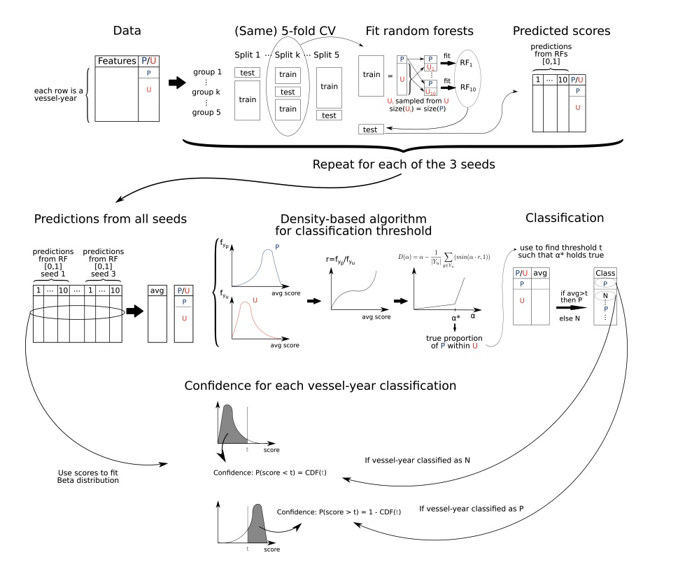

# Forced labor risk workflow on a sample dataset

### Overview

`forcedlabor` is an R package developed for training a
positive–unlabeled (PU) model to detect fishing vessels exhibiting
behaviors or characteristics consistent with forced-labor offenders.

The model characteristics, particularly the PU approach, obey to the
nature of the available data on forced labor:

- We have **positive cases** of forced labor, which refer to vessels
  reported to have engaged in forced labor. The model uses *vessel-year*
  as a unit for forced labor cases.
- While there are confirmed reports of certain vessels engaged in forced
  labor, a confirmation of the absence of forced labor is extremely
  difficult to find. The immense majority of vessels are not inspected
  for labor exploitation, and even those that are, are usually inspected
  at port. A certification in port is not 100% guarantee of the absence
  of forced labor at sea. So instead of having negative cases to train
  the model along with the positive ones, the model takes **unlabeled
  cases**–with an unknown mix of positive and negative cases. Unlabeled
  cases are thus vessel-year combinations for which we have no
  information (no evidence of being positive but also no evidence of
  them being negative).
- We had access to a list of vessels certified as compliant with the ILO
  C188 requirements for work and living conditions. These certifications
  were based on documents and inspections at port. They can be seen as
  **negative cases**, but for the reasons mentioned above, they are not
  used for training the model. We rather generate predictions for them
  after the training, expecting them to be classified as negative.

### The dataset in this package

The dataset, `fl_sample_data`, comes from a real dataset of positive and
unlabeled cases, with one row per vessel-year and columns corresponding
to vessel identity, the features of the model based on AIS data (and
briefly described in the section below), and columns to identify the
positive cases (`known_offender` column), negative cases
(`known_non_offender` column), and unlabeled cases (`0` values in
`known_offender` and in `known_non_offender`). The original dataset
contained more than 100 positive cases and almost a million vessel-years
of unlabeled data. The gear types included are trawlers, longlines and
squid jiggers. To generate `fl_sample_data`, we anonymized the vessels,
kept most of the positives (127), and randomly sampled 10,000
vessel-years from the unlabeled, so that there could be a manageable
sample to run the functions in the package in a local computer. This
sample does not contained real negative cases (the C188-certified
vessels), as they were obtained under a non-disclosure agreement. If
further negative cases are made available and it is possible to share
them publicly, we could add them to the holdout dataset of the package
in the future.

In `fl_sample_data`, 100 of the positives are meant to be used to train
the model and the other 27 should be used as a holdout dataset. 9900 of
the unlabeled would be used for training and the other 100 would be used
as a holdout dataset. The holdout dataset is later used to compute
performance metrics. The rows with `holdout == 1` correspond to the
holdout dataset and those with `holdout == 0`, to the training dataset.

``` r
library(forcedlabor)
```

``` r
data("fl_sample_data")
training_df <- fl_sample_data |> filter(holdout == 0)
holdout_df <- fl_sample_data |> filter(holdout == 1)
```

### Model features

The features used for classification correspond to vessel
characteristics and variables describing vessel activity at sea that can
help identify vessel with forced-labor-like movement patterns.

The features for this model were computed from Automatic Identification
System (AIS) data processed by Global Fishing Watch.

The rationale behind why we selected these features is summarized below.

#### Vessel characteristics

- *Gear type* shapes expected movement.
- *Length*, *tonnage* and *engine power* may enable longer, farther
  operations—factors associated with elevated forced-labor risk.

#### Time at sea

Long voyages and infrequent port visits allow vessels to avoid
inspections and limit crew opportunities to report or exit abusive
conditions. Excessive overtime is a common indicator of abuse. The
following variables are included to capture unusually long daily or
yearly effort:

- *number of AIS positions*
- *number of hours at sea*
- *number of voyages*
- *average voyage duration* (in hours)
- *total number of fishing hours*
- *average daily fishing hours*

#### Distance from shore and port

Operating far from shore may mean greater isolation and reduced
oversight. The model includes:

- *maximum distance from port* (km)
- *maximum distance from shore* (km)

#### Multijurisdictional issues

Time in foreign EEZs or on the High Seas, and foreign port visits,
increase the jurisdictional complexity to address forced labor cases.
The model includes:

- *number of fishing hours in foreign EEZs*
- *number of fishing hours in the High Seas*
- *number of foreign port visits*

#### Transshipment, encounters, and loitering

Encounters and loitering (stationary behavior at sea that may indicate
a  
potential encounter with a non-AIS-broadcasting vessel) patterns can
indicate transshipment events. Transshipments can prolong the time at
sea and enable crew transfers, both of which are linked to higher risk
of forced labor. The model includes:

- *number of encounters with other vessels at sea*
- *number of encounters with vessels reported to have engaged in forced
  labor*,
- *average encounter duration* (hours)
- *number of loitering events*
- *average loitering duration* (hours).

#### AIS disabling events-“gaps”

Intentional AIS disabling can obscure activity and mask behaviors such
as transshipment or other evasive practices. The model includes:

- *number of intentional gaps*
- *average duration (in days) for these gaps*
- *average distance* between the location where an intentional gap
  begins and the location where it ends
- *average distance from port during these gaps*
- *average distance from shore during these gaps*

### Model workflow

The `forcedlabor` package allows to execute the workflow described in
(Joo et al. 2023) (and updated in a paper in review).



- The function
  [`fl_rfsetup()`](https://github.com/GlobalFishingWatch/forcedlabor/reference/fl_rfsetup.md)
  sets up the model features, response variables, and the parameters
  required to configure random forests (RFs): our model first fits a
  series of random forests, using the `ranger` engine within a
  `tidymodels` framework.
- The function
  [`fl_cvsetup()`](https://github.com/GlobalFishingWatch/forcedlabor/reference/fl_cvsetup.md)
  takes the output of
  [`fl_rfsetup()`](https://github.com/GlobalFishingWatch/forcedlabor/reference/fl_rfsetup.md)
  and fixes the number of folds (k), bags, seeds and downsampling ratio
  required to run the cross-validations. These are described in the
  sections below.
- The function
  [`fl_train()`](https://github.com/GlobalFishingWatch/forcedlabor/reference/fl_train.md)
  fits the RFs for one seed and one bag using the `recipe` configuration
  from
  [`fl_cvsetup()`](https://github.com/GlobalFishingWatch/forcedlabor/reference/fl_cvsetup.md),
  creating a series of RF scores for the training data, and optionally,
  for the holdout dataset.
- The function
  [`fl_classification()`](https://github.com/GlobalFishingWatch/forcedlabor/reference/fl_classification.md)
  implements the DEDPUL algorithm, calculating a calibrated threshold
  `t` and classifying the average RF scores against `t` to classify each
  of them as `positive` or `negative`. The calculation of confidence
  values can be done optionally.
- The function
  [`fl_perf_metrics()`](https://github.com/GlobalFishingWatch/forcedlabor/reference/fl_perf_metrics.md)
  calculates recall and specificity (if a `holdout` dataset is
  provided).

### Feature pre-processing and model configuration using `fl_rfsetup()` and `fl_cvsetup()`

Following the `tidymodels` framework, the function
[`fl_rfsetup()`](https://github.com/GlobalFishingWatch/forcedlabor/reference/fl_rfsetup.md)
calls `recipes` package functions to preprocess the training dataset,
specifying roles and transformations for model features. Importantly, it
distinguishes which features will be used as predictors, which one is
the response variable and which one will be used as `control` variable
to avoid data leakage.

Vessel `MMSI` (Maritime Mobile Service Identity) –which can appear in
several related cases–is thus used as a control variable against data
leakage (all vessel-year cases from the same vessel were assigned to
either the training or the holdout dataset). This corresponds to the
column `ssvid`.

Feature transformations included removing near-zero variance variables
with
[`recipes::step_nzv()`](https://recipes.tidymodels.org/reference/step_nzv.html)
and removing highly correlated variables (correlation value can be setup
by parameter `corr_threshold`).

[`fl_rfsetup()`](https://github.com/GlobalFishingWatch/forcedlabor/reference/fl_rfsetup.md)
also calls the `parsnip` package to specify hyperparameter values of the
RFs, such as the number of trees, the number of features that will be
sampled at each split, the minimum node size and the regularization
factor. The chosen model engine was the one in package `[ranger]`.

``` r
features_model_characteristics <- c("gear",
                                    "engine_power_kw",
                                    "tonnage_gt",
                                    "length_m")
features_model_movement <- c("position_messages",
                             "hours",
                             "fishing_hours",
                             "average_daily_fishing_hours",
                             "fishing_hours_foreign_eez",
                             "fishing_hours_high_seas",
                             "max_distance_from_shore_km",
                             "max_distance_from_port_km",
                             "number_encounters",
                             "number_forced_labor_encounters",
                             "average_encounter_duration_hours",
                             "gaps_12_hours",
                             "average_off_distance_from_port_km",
                             "average_off_distance_from_shore_km",
                             "average_gap_days",
                             "average_gap_km",
                             "number_foreign_port_visits",
                             "number_loitering_events",
                             "average_loitering_duration_hours",
                             "average_voyage_duration_hours",
                             "number_voyages")

rf_setup <- fl_rfsetup(training_data = training_df,
                       y = "known_offender",
                       x = c(features_model_characteristics,
                             features_model_movement),
                       id = "indID",
                       dont_use = c("known_non_offender"),
                       control = "ssvid",
                       corr_threshold = 0.75,
                       rf_trees = 500,
                       rf_mtry = 5,
                       rf_min_n = 10,
                       rf_reg_factor = 1)
```

The function returns a list with the two elements corresponding to the
setup above:

- `$rf_recipe`, with the output from `recipes`
- `$rf_spec` with the RF specification by `parsnip`

#### Function `fl_cvsetup()`

The function
[`fl_cvsetup()`](https://github.com/GlobalFishingWatch/forcedlabor/reference/fl_cvsetup.md)
creates the whole framework to fit the RF models for each seed, bag, and
fold, from the training data, the model recipe and the RF specification.
As shown in the Figure of the model workflow, we do a k-fold
cross-validation to split the data into analysis (to train an RF) and
assessment (to generate RF scores) for vessel-years that were not used
to train the RF. In this case, we are doing a 5-fold cross-validation
(that will use `ssvid` as a variable to control for data leakage), so
`num_folds = 5`. In each analysis set, the unlabeled cases are more
numerous than the positive cases. For that reason, we downsample the
unlabeled in the analysis set with a downsampling ratio. In this case,
we use a 1:1 ratio. The downsampling procedure is repeated `num_bags`
times (in this case, 10 bags) for each of the five splits. The partition
of samples into analysis and assessment during cross-validation, the
downsampling (`num_bags` times) and fitting the RFs for each bag and
fold combination, is done for a given initial randomization seed. We
repeat this process for `num_common_seeds = 3`. With 10 bags and 3
seeds, this yields 30 RF scores per case (i.e. vessel-year).

``` r
num_folds <- 5
num_bags <- 10
down_sample_ratio <- 1
num_common_seeds <- 3

tictoc::tic()
cv_df <- fl_cvsetup(training_data = training_df,
                    fl_rec = rf_setup$rf_recipe,
                    rf_spec = rf_setup$rf_spec,
                    num_seeds = num_common_seeds,
                    num_bags = num_bags,
                    num_folds = num_folds,
                    down_sample_ratio = down_sample_ratio)
tictoc::toc()
#> 0.918 sec elapsed
```

The output of this function is a list with `seeds x bags` elements
(here: 3 seeds and 10 bags = 30 elements). Each element of this list
includes the seed, bag number, recipe and a tibble object with the
k-fold cross-validation splits, where the unlabeled data has been
downsampled by
[`themis::step_downsample()`](https://themis.tidymodels.org/reference/step_downsample.html)
and the folds have been created by
[`rsample::group_vfold_cv()`](https://rsample.tidymodels.org/reference/group_vfold_cv.html).

### Training the models: function `fl_train()`

Once the training data has been prepped and the model recipe and
specifications set, we can now use function
[`fl_train()`](https://github.com/GlobalFishingWatch/forcedlabor/reference/fl_train.md)
to fit RF models and generate scores.

Function
[`fl_train()`](https://github.com/GlobalFishingWatch/forcedlabor/reference/fl_train.md)
fits a RF for each fold for a bag and a seed configuration using the
previous recipe, specification steps and cross-validation setup.

- It applies a downsampling ratio of 1:1 to the training set
- This step returns a list with 2 elements: `train_probabilities` and
  `pred_probabilities` **if `holdout` was included**.
  `train_probabilities` is list with *k* elements, which are tibbles.
  Each tibble contains RF scores for its corresponding assessment rows
  (from the k-fold validation). `pred_probabilities` is also a list with
  *k* tibbles. Each tibble contains RF scores for the holdout rows,
  using the RF fitted with the analysis rows (from the k-fold
  validation).

The function is written to receive a single element of the output of
[`fl_cvsetup()`](https://github.com/GlobalFishingWatch/forcedlabor/reference/fl_cvsetup.md)
(`cv_df` in this example). So a single run (with 5 folds) could be
generated like this:

``` r
tictoc::tic()
one_trained_model <- fl_train(cv_setup = cv_df[[1]],
                              rf_spec = rf_setup$rf_spec,
                              holdout = holdout_df)
tictoc::toc()
```

Tibbles from both `train_probabilities` and `pred_probabilities` include
the following columns: `.pred_1` (RF scores), `indID` (unique vessel
identifier), `known offender`, `known non offender` (unavailable in this
dataset), and `holdout`.

To train RFs and get scores for all seeds and bags, we can use `for`
loops or
[`purrr::map()`](https://purrr.tidyverse.org/reference/map.html), or
parallelize in machines with very large RAM. In this example, let’s use
[`purrr::map()`](https://purrr.tidyverse.org/reference/map.html).

Note that the use of `holdout` is optional. If omitted,
[`fl_train()`](https://github.com/GlobalFishingWatch/forcedlabor/reference/fl_train.md)
will produce RF scores for the training data only. If added, it will
create RF scores for new data that is not used in model training.

``` r
tictoc::tic()
trained_models <- purrr::map(.x = cv_df,
                             ~fl_train(rf_spec = rf_setup$rf_spec,
                                       holdout = holdout_df))

tictoc::toc()
#> 143.73 sec elapsed
```

`trained_models` is composed of a list of length `bags x seeds` (in this
case, 30). Each element of that list contains the two elements described
above, `train_probabilities` and `pred_probabilities` **if `holdout` was
included**.

Let’s extract both lists and create a single dataframe for all

``` r

train_probabilities_all <- purrr::map(trained_models, "train_probabilities") |> bind_rows()
pred_probabilities_all <- purrr::map(trained_models, "pred_probabilities") |> bind_rows()
prob_all <- bind_rows(pred_probabilities_all,
                      train_probabilities_all)
head(prob_all)
#> # A tibble: 6 × 8
#>   .pred_1 indID      known_offender known_non_offender holdout common_seed   bag
#>     <dbl> <chr>      <fct>          <fct>                <dbl>       <dbl> <int>
#> 1   0.966 6925-4049… 1              0                        1           1     1
#> 2   0.996 2070-8649… 1              0                        1           1     1
#> 3   0.218 2274-4290… 1              0                        1           1     1
#> 4   0.993 7851-9061… 1              0                        1           1     1
#> 5   0.282 8482-2197… 1              0                        1           1     1
#> 6   0.945 9655-3925… 1              0                        1           1     1
#> # ℹ 1 more variable: id <chr>
```

#### Function `fl_classification()`: density-based algorithm for classification

threshold

[`fl_classification()`](https://github.com/GlobalFishingWatch/forcedlabor/reference/fl_classification.md)
aggregates all RF scores for each row, estimates $\alpha$ (upper bound
on positives in the unlabeled set) and estimates a threshold `t` so that
the proportion of predicted positives ≈ $\alpha$.

See (Ivanov 2020) for more details on the DEDPUL algorithm.

``` r
tictoc::tic()
classif_res <- fl_classification(data = prob_all,
                                 steps = 1000,
                                 plotting = FALSE,
                                 filepath = NULL,
                                 threshold = seq(0, .99, by = 0.01),
                                 eps = 0.1,
                                 confidence_levels = TRUE
                                 )
#> [1] "alpha:  0.0530530530530531"
tictoc::toc()
#> 11.862 sec elapsed
```

- Within
  [`fl_classification()`](https://github.com/GlobalFishingWatch/forcedlabor/reference/fl_classification.md)
  we apply the calibrated threshold `t` to each vessel’s mean RF score
  (`pred_mean`):  
  if `pred_mean > t`, then `pred_class = 1`, else `0`. This produces a
  binary prediction (positive or negative, stored in column
  `pred_class`).
- The `confidence` value indicates how consistently a vessel’s score
  falls on the same side of `t` across seeds × bags. Values near 1
  indicate a very stable classification for that vessel-year
  (i.e. higher confidence in the classification).

``` r
class_pos <- sum(classif_res$pred_conf$pred_class == 1)
class_neg <- sum(classif_res$pred_conf$pred_class == 0)
```

In the case of this sample dataset, 10072 vessel-years were classified
as negative and 55 were classified as positive for forced labor risk.

### Assessing model performance with function `fl_perf_metrics()`

The performance of the model is evaluated through:

- `recall`: the proportion of positive cases predicted by the model as
  positive
- `specificity`: if negative holdout cases have been provided, it is
  computed as the proportion of negative cases correctly predicted by
  the model as negatives

``` r

tictoc::tic()
perf_metrics <- fl_perf_metrics(data = classif_res$pred_conf)
#> Warning: While computing binary `spec()`, no true negatives were detected (i.e.
#> `true_negative + false_positive = 0`).
#> Specificity is undefined in this case, and `NA` will be returned.
#> Note that 0 predicted negatives(s) actually occurred for the problematic event
#> level, 1
tictoc::toc()
#> 0.054 sec elapsed

print(perf_metrics)
#>   recall specif
#> 1   0.16     NA
```

#### Fairness tests

Statistical non-discrimination or fairness measures aim to assess the
absence or degree of discrimination of given groups regarding
classification.

In this context, this meant assessing whether the model was equally
successful (or unsuccessful) at classifying positive vessel-years across
different fishing gears.

``` r

# Recall by gear

gear_lookup <- training_df  |>
  distinct(indID, gear)

gear_lookup |> count(gear)
#> # A tibble: 3 × 2
#>   gear                   n
#>   <fct>              <int>
#> 1 drifting_longlines  1019
#> 2 squid_jigger         383
#> 3 trawlers            8598

gear_lookup |> 
left_join(classif_res$pred_conf) |>
 group_by(gear) |> 
 mutate(
   known_offender = factor(as.character(known_offender), levels = c("0","1")),
   pred_class     = factor(as.character(pred_class),     levels = c("0","1"))
 ) |> 
 yardstick::recall(truth = known_offender,
        estimate = pred_class, event_level = "second")  |> 
 select(gear, .estimate)
#> Joining with `by = join_by(indID)`
#> # A tibble: 3 × 2
#>   gear               .estimate
#>   <fct>                  <dbl>
#> 1 drifting_longlines    0.0833
#> 2 squid_jigger          0.241 
#> 3 trawlers              0
```

Unsurprisingly, the randomized sample was not large enough for the model
to learn to disentangle forced-labor-like behaviors, but this was
necessary to reduce computational costs for this vignette.

## References

Ivanov, D. 2020. “DEDPUL: Difference-of-Estimated-Densities-Based
Positive-Unlabeled Learning.” *ArXiv*.
<https://doi.org/10.48550/arXiv.1902.06965>.

Joo, R., G. McDonald, N. Miller, D. Kroodsma, C. Farthing, D. Belhabib,
and T. Hochberg. 2023. “Towards a Responsible Machine Learning Approach
to Identify Forced Labor in Fisheries.” *ArXiv*.
<https://doi.org/10.48550/arXiv.2302.10987>.
